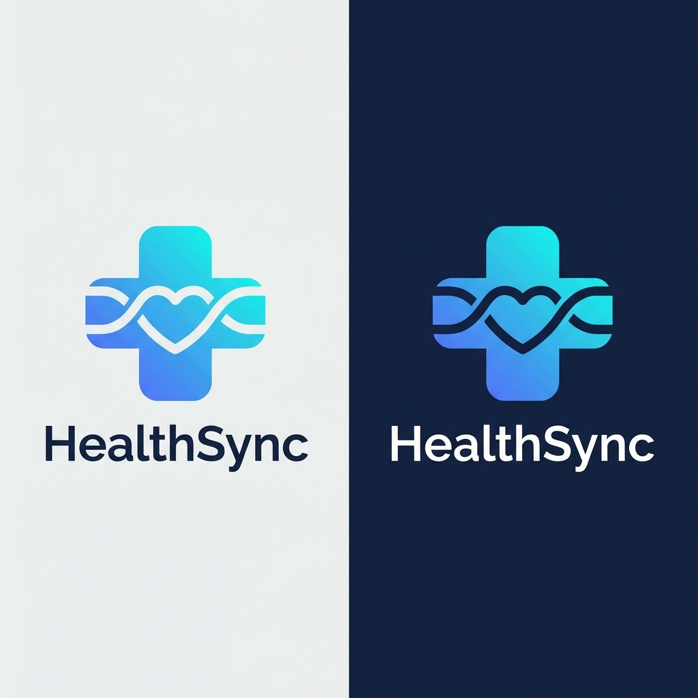
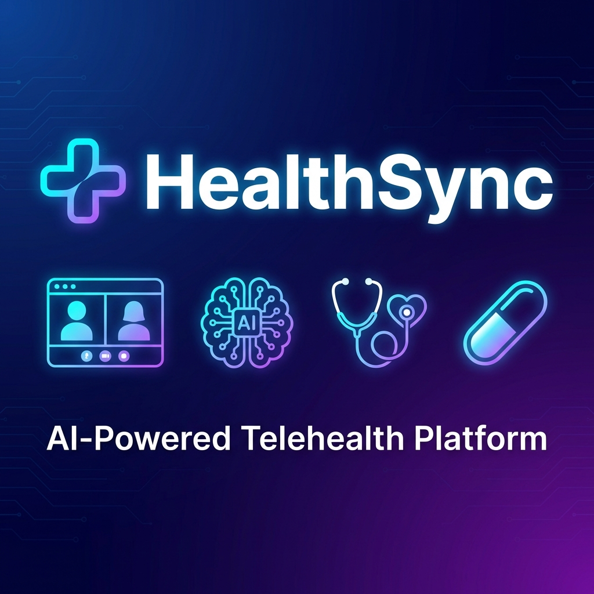

# 🏥 HealthSync - AI-Powered Telehealth Platform

[](https://healthsync.himanshu-sharma.me)
[](https://youtu.be/-nLdea5sPCk)
[](https://github.com/himanshu-sharma-dev1/healthsync-app)

> **Veersa Hackathon 2026** | Making Quality Healthcare Accessible from Anywhere

<p align="center">
  
</p>

---

## 🎯 Problem Statement

Post pandemic, quick access to quality, affordable and reliable healthcare from anywhere is the need of the hour. People are confined in remote locations and need a digitally enabled solution for instant healthcare access.

**Key Challenges:**
- Limited access to specialists in rural areas
- Language and dialect barriers in consultations
- Lack of digital prescription management
- Emergency detection during consultations
- Secure payment and data handling

---

## 💡 Our Solution

**HealthSync** is a comprehensive AI-powered telehealth platform that bridges the gap between patients and healthcare providers through cutting-edge technology.

---

## 🎥 Demo Video

<p align="center">
  <a href="https://youtu.be/-nLdea5sPCk">
    
  </a>
</p>

<p align="center">
  👆 <strong>Click to watch the full demo</strong> | <a href="docs/demo_video.mp4">Download Video</a>
</p>

---

## 🔥 Key Features

| # | Feature | How to Demo |
|---|---------|-------------|
| 1 | 🤖 **AI Symptom Analysis** | Dashboard → Chat icon → Type symptoms |
| 2 | 📧 **Medication Email Reminder** | Medication Tracker → "📧 Test Email" |
| 3 | 📊 **Weekly Medication View** | Medication Tracker → "📆 Week" toggle |
| 4 | 🚨 **Emergency Detection** | Video Call → Say "chest pain" |
| 5 | 📝 **Real-Time Transcription** | Video Call → Speak → Watch text appear |
| 6 | 📧 **Auto Email After Payment** | Complete payment → See "✅ Email sent" |
| 7 | 📧 **Appointment Email Button** | Dashboard → Click 📧 on appointment card |
| 8 | 🔐 **Google OAuth Login** | Login → "Sign in with Google" |
| 9 | 💊 **PDF Prescription Download** | Prescriptions → "Download PDF" |
| 10 | 🌍 **Multi-Language Support** | Any page → Language toggle (EN/HI) |

---

## ✨ All Features

| Feature | Description |
|---------|-------------|
| 📹 **HD Video Consultations** | Real-time video calls with screen sharing and chat |
| 🤖 **AI Emergency Detection** | Automatic detection of 25+ emergency keywords during calls |
| 🩺 **AI Doctor Recommendations** | Smart specialty matching based on symptoms |
| 📋 **Digital Prescriptions** | Generate and download professional PDF prescriptions |
| 🎙️ **Live Transcription** | Real-time speech-to-text with DeepGram AI |
| 💊 **Medication Tracker** | Weekly view with email reminders |
| 🔐 **Google OAuth** | Secure one-click login with Google |
| 💳 **Dual Payment Options** | Square API + Stripe for flexible payments |
| 🧠 **Gemini AI Integration** | Symptom analysis and consultation summaries |
| 📧 **Email Notifications** | Booking confirmations, medication reminders, password reset |
| 🌗 **Dark/Light Mode** | Theme switching with header toggle |
| ♿ **Accessibility Panel** | High contrast, font size controls |
| 📊 **Performance Metrics** | Real-time load times and memory usage |
| 🌐 **Multi-language** | English & Hindi language support |

---

## 🏗️ Architecture

```
┌─────────────────────────────────────────────────────────────────┐
│                        FRONTEND (React + Vite)                   │
├─────────────────────────────────────────────────────────────────┤
│  Pages          │  Components       │  Services                  │
│  ├── Home       │  ├── Navbar       │  ├── aiService.js         │
│  ├── Dashboard  │  ├── VideoCall    │  ├── pdfGenerator.js      │
│  ├── Doctors    │  ├── Chat         │  ├── reminderService.js   │
│  ├── VideoCall  │  ├── Prescription │  └── firebase.js          │
│  └── Profile    │  └── Transcription│                           │
└─────────────────┴───────────────────┴───────────────────────────┘
                              │
                              ▼
┌─────────────────────────────────────────────────────────────────┐
│                     BACKEND (Node.js + Express)                  │
├─────────────────────────────────────────────────────────────────┤
│  Routes              │  Services           │  Middleware         │
│  ├── auth.js         │  ├── emailService   │  ├── auth.js       │
│  ├── googleAuth.js   │  └── (SendGrid/SMTP)│  ├── hipaa.js      │
│  ├── passwordReset.js│                     │  └── rateLimit.js  │
│  ├── doctors.js      │  Database           │                     │
│  └── appointments.js │  └── MongoDB Atlas  │                     │
└──────────────────────┴─────────────────────┴────────────────────┘
                              │
                              ▼
┌─────────────────────────────────────────────────────────────────┐
│                      EXTERNAL SERVICES                           │
├────────────┬────────────┬────────────┬────────────┬────────────┤
│  Daily.co  │  DeepGram  │   Square   │   Stripe   │  SendGrid  │
│  (Video)   │(Transcribe)│ (Payment1) │ (Payment2) │  (Email)   │
├────────────┴────────────┴────────────┴────────────┴────────────┤
│              Google OAuth  │  Gemini AI  │  Firebase            │
└──────────────┴──────────────┴──────────────┴───────────────────┘
```

---

## 🛠️ Tech Stack

### Frontend
| Technology | Purpose |
|------------|---------|
| React 18 | UI Framework |
| Vite | Build Tool |
| React Router | Navigation |
| jsPDF | PDF Generation |
| Socket.io Client | Real-time Communication |

### Backend
| Technology | Purpose |
|------------|---------|
| Node.js | Runtime |
| Express.js | API Framework |
| MongoDB + Mongoose | Database |
| JWT | Authentication |
| SendGrid / Nodemailer | Email Services |

### External APIs
| Service | Purpose |
|---------|---------|
| Daily.co | WebRTC Video Calls |
| DeepGram | Real-time Transcription |
| Square | Payment Processing (Primary) |
| Stripe | Payment Processing (Alternative) |
| Google OAuth | Social Login |
| Gemini AI | Symptom Analysis & Summaries |
| SendGrid | Transactional Emails |

---

## 📐 Design & Documentation

### UI/UX Design
- **Design Presentation:** [View PDF](./docs/HealthSync_Design_Presentation.pdf)
- **Information Architecture:** [View Document](./docs/INFORMATION_ARCHITECTURE.md)

### Design System
| Element | Value |
|---------|-------|
| Primary Color | #0EA5E9 (Blue) |
| Secondary Color | #10B981 (Green) |
| Font Family | Inter |
| Dark/Light Mode | ✅ Supported |

### Testing Documentation
- **Manual Test Cases:** [41 Test Cases](./docs/MANUAL_TEST_CASES.md)
- **Automated Tests:** [Testing Guide](./docs/AUTOMATED_TESTS.md)

---

## 🚀 Getting Started

### Prerequisites
- Node.js 18+
- npm or yarn
- MongoDB Atlas account
- API keys for Daily.co, DeepGram, Square, SendGrid

### Installation

```bash
# Clone the repository
git clone https://github.com/himanshu-sharma-dev1/healthsync-app.git
cd healthsync-app

# Install frontend dependencies
cd client && npm install

# Install backend dependencies
cd ../server && npm install

# Configure environment variables
cp .env.example .env
# Edit .env with your API keys

# Start development servers
# Terminal 1 - Backend
cd server && npm run dev

# Terminal 2 - Frontend
cd client && npm run dev
```

### Environment Variables

```env
# Server (.env)
MONGODB_URI=your_mongodb_connection_string
JWT_SECRET=your_jwt_secret
DAILY_API_KEY=your_daily_api_key
DEEPGRAM_API_KEY=your_deepgram_key
SQUARE_ACCESS_TOKEN=your_square_token
SENDGRID_API_KEY=your_sendgrid_key
GOOGLE_CLIENT_ID=your_google_oauth_id
GOOGLE_CLIENT_SECRET=your_google_oauth_secret
```

---

## 📁 Project Structure

```
healthsync-app/
├── client/                     # React Frontend
│   ├── src/
│   │   ├── assets/             # Images, icons
│   │   ├── components/         # Reusable UI components
│   │   ├── context/            # Auth, Theme, Language contexts
│   │   ├── hooks/              # Custom React hooks
│   │   ├── pages/              # Page components
│   │   │   ├── Dashboard.jsx   # Patient dashboard
│   │   │   ├── VideoCall.jsx   # Video consultation
│   │   │   ├── DoctorPrescription.jsx
│   │   │   ├── ForgotPassword.jsx
│   │   │   └── ...
│   │   ├── services/           # API & utility services
│   │   │   ├── aiService.js    # Emergency detection
│   │   │   ├── pdfGenerator.js # Prescription PDFs
│   │   │   └── reminderService.js
│   │   └── utils/
│   └── package.json
│
├── server/                     # Node.js Backend
│   ├── src/
│   │   ├── config/             # DB, API configurations
│   │   ├── middleware/         # Auth, HIPAA, rate limiting
│   │   ├── models/             # MongoDB schemas
│   │   ├── routes/             # API endpoints
│   │   │   ├── auth.js
│   │   │   ├── googleAuth.js
│   │   │   ├── passwordReset.js
│   │   │   └── ...
│   │   ├── services/           # Email, integrations
│   │   │   └── emailService.js
│   │   └── index.js
│   └── package.json
│
└── docs/                       # Documentation
```

---

## 🎥 Demo Features

### Patient Flow
1. **Registration/Login** - Email or Google OAuth
2. **Find Doctors** - Browse by specialty, ratings
3. **Book Appointment** - Select date/time, pay securely
4. **Video Consultation** - HD video with live transcription
5. **Receive Prescription** - Download PDF prescription
6. **View History** - Past consultations and prescriptions

### Doctor Flow
1. **Dashboard** - View appointments
2. **Join Consultation** - Video call with patient
3. **Write Prescription** - Digital prescription form
4. **AI Assistance** - Emergency alerts, transcription

### AI Features
- **Emergency Detection**: Monitors for keywords like "chest pain", "can't breathe", "emergency"
- **Real-time Transcription**: DeepGram-powered speech-to-text
- **Consultation Summaries**: AI-generated visit summaries

---

## 👥 Team HealthSync

| Name | Role | GitHub |
|------|------|--------|
| Himanshu Sharma | Full-Stack Lead | [@himanshu-sharma-dev1](https://github.com/himanshu-sharma-dev1) |
| Harsh Kashyap | Backend Developer | [@harsh-kashyap](https://github.com/harsh-kashyap) |
| Sumit Srivastav | Frontend Developer | [@sumit-srivastav](https://github.com/sumit-srivastav) |

---

## 📊 Hackathon Evaluation Criteria

| Criteria | Our Implementation |
|----------|-------------------|
| ✅ Innovation | AI emergency detection, real-time transcription |
| ✅ Functionality | Complete patient-doctor consultation flow |
| ✅ User Experience | Modern UI, accessibility, multi-language |
| ✅ Technical Excellence | MERN stack, WebRTC, multiple API integrations |
| ✅ Scalability | MongoDB Atlas, modular architecture |
| ✅ Security | JWT auth, HIPAA compliance, secure payments |

---

## 🔗 Links

- **GitHub Repository**: [github.com/himanshu-sharma-dev1/healthsync-app](https://github.com/himanshu-sharma-dev1/healthsync-app)
- **Live Demo**: [healthsync.himanshu-sharma.me](https://healthsync.himanshu-sharma.me)

---

## 📝 License

This project is created for **Veersa Hackathon 2026**.

---

<p align="center">
  <b>Built with ❤️ for better healthcare access</b><br>
  <sub>Making quality healthcare accessible from anywhere</sub>
</p>
