# HealthSync - Information Architecture

## Project Overview

**Application:** HealthSync - AI-Powered Telehealth Platform  
**Type:** Web Application (Responsive)  
**Target Users:** Patients, Doctors, Healthcare Administrators  

---

## 1. Site Map

```mermaid
graph TD
    subgraph Public Pages
        HOME[🏠 Home Page]
        LOGIN[🔐 Login]
        REGISTER[📝 Register]
        FORGOT[🔑 Forgot Password]
    end

    subgraph Patient Portal
        PDASH[📊 Patient Dashboard]
        DOCTORS[👨‍⚕️ Find Doctors]
        INTAKE[📋 Patient Intake Form]
        BOOK[📅 Book Appointment]
        PAYMENT[💳 Payment]
        VIDEO[📹 Video Consultation]
        PROFILE[👤 My Profile]
        APPOINTMENTS[📆 My Appointments]
        PRESCRIPTIONS[💊 E-Prescriptions]
        SUMMARY[📄 Consultation Summary]
    end

    subgraph Doctor Portal
        DDASH[📊 Doctor Dashboard]
        DRXWRITE[📝 Write Prescription]
        DAPPTS[📆 Doctor Appointments]
    end

    HOME --> LOGIN
    HOME --> REGISTER
    HOME --> DOCTORS
    LOGIN --> PDASH
    LOGIN --> DDASH
    REGISTER --> PDASH
    FORGOT --> LOGIN

    PDASH --> DOCTORS
    PDASH --> APPOINTMENTS
    PDASH --> PROFILE
    PDASH --> PRESCRIPTIONS

    DOCTORS --> BOOK
    INTAKE --> DOCTORS
    BOOK --> PAYMENT
    PAYMENT --> VIDEO
    VIDEO --> SUMMARY
    VIDEO --> DRXWRITE

    DDASH --> DAPPTS
    DDASH --> DRXWRITE

    SUMMARY --> PRESCRIPTIONS
    DRXWRITE --> PRESCRIPTIONS
```



---

## 2. User Flows

### 2.1 Patient Journey - Book & Attend Consultation

```mermaid
flowchart TD
    START((🚀 Start)) --> HOME[Visit HealthSync Home]
    HOME --> AUTH{Logged In?}
    
    AUTH -->|No| LOGIN[Login / Register]
    AUTH -->|Yes| DASHBOARD[Patient Dashboard]
    LOGIN --> DASHBOARD
    
    DASHBOARD --> FINDDOC[Browse/Search Doctors]
    FINDDOC --> FILTER[Filter by Specialty/Rating]
    FILTER --> SELECT[Select Doctor]
    
    SELECT --> INTAKE[Fill Patient Intake Form]
    INTAKE --> SYMPTOMS[Describe Symptoms]
    SYMPTOMS --> AISPEC[AI Suggests Specialty]
    AISPEC --> BOOK[Select Date & Time]
    
    BOOK --> PAYMENT[Payment Page]
    PAYMENT --> PAYMETHOD{Choose Method}
    PAYMETHOD -->|Square| SQUARE[Square Payment]
    PAYMETHOD -->|Stripe| STRIPE[Stripe Checkout]
    
    SQUARE --> CONFIRM[Booking Confirmed]
    STRIPE --> CONFIRM
    
    CONFIRM --> WAIT[Wait for Appointment]
    WAIT --> JOIN[Join Video Call]
    
    JOIN --> CONSULT[Video Consultation]
    CONSULT --> FEATURES[Use Features]
    FEATURES --> CHAT[In-Call Chat]
    FEATURES --> TRANS[Live Transcription]
    FEATURES --> TRANSLATE[Translation]
    
    CONSULT --> ENDC[End Call]
    ENDC --> SUMMARY[View Summary]
    SUMMARY --> RX[View E-Prescription]
    RX --> DOWNLOAD[Download PDF]
    DOWNLOAD --> END((✅ Complete))
```



### 2.2 Doctor Journey - Conduct Consultation

```mermaid
flowchart TD
    START((🚀 Start)) --> LOGIN[Doctor Login]
    LOGIN --> DASH[Doctor Dashboard]
    
    DASH --> VIEW[View Today's Appointments]
    VIEW --> SELECT[Select Appointment]
    SELECT --> JOIN[Join Video Call]
    
    JOIN --> CONSULT[Conduct Consultation]
    CONSULT --> LISTEN[Listen to Patient]
    LISTEN --> EXAMINE[Remote Examination]
    
    EXAMINE --> TRANS[View Live Transcription]
    TRANS --> TERMS[See Highlighted Medical Terms]
    
    CONSULT --> WRITE[Write Prescription]
    WRITE --> DIAG[Enter Diagnosis]
    DIAG --> MEDS[Add Medications]
    MEDS --> ADVICE[Add Advice & Lab Tests]
    ADVICE --> SAVE[Save & Generate PDF]
    
    SAVE --> SEND[Send to Patient]
    SEND --> ENDC[End Call]
    ENDC --> NEXT{More Patients?}
    
    NEXT -->|Yes| VIEW
    NEXT -->|No| END((✅ Done))
```



### 2.3 Emergency Detection Flow

```mermaid
flowchart TD
    CALL[During Video Call] --> TRANS[Transcription Active]
    TRANS --> AI[AI Analyzes Speech]
    AI --> CHECK{Emergency Keywords?}
    
    CHECK -->|No| CONTINUE[Continue Normal Call]
    CONTINUE --> TRANS
    
    CHECK -->|Yes| DETECT[Emergency Detected!]
    DETECT --> SEVERITY{Severity Level}
    
    SEVERITY -->|Critical| CRIT[🚨 Critical Alert Banner]
    SEVERITY -->|Moderate| MOD[⚠️ Warning Banner]
    
    CRIT --> ACTIONS[Show Emergency Actions]
    MOD --> ACTIONS
    
    ACTIONS --> CALL112[📞 Call 112 Button]
    ACTIONS --> DISMISS[Dismiss Alert]
    
    CALL112 --> PHONE[Initiate Emergency Call]
    DISMISS --> CONTINUE
```



---

## 3. Page Inventory

| # | Page Name | Route | Purpose | Key Features |
|---|-----------|-------|---------|--------------|
| 1 | Home | `/` | Landing page | Hero, Features, Testimonials, Doctor Preview |
| 2 | Login | `/login` | User authentication | Email/Password, Google OAuth, Demo Credentials |
| 3 | Register | `/register` | New user signup | Role selection, Form validation |
| 4 | Dashboard | `/dashboard` | User home after login | Stats, Upcoming appointments, Quick actions |
| 5 | Doctors | `/doctors` | Browse doctors | Search, Filter by specialty, Ratings |
| 6 | Patient Intake | `/patient-intake` | Pre-consultation form | Symptoms, AI specialty suggestion |
| 7 | Book Appointment | `/book/:doctorId` | Schedule consultation | Calendar, Time slots, Summary |
| 8 | Payment | `/payment` | Process payment | Square, Stripe integration |
| 9 | Video Call | `/video/:appointmentId` | Live consultation | Video, Chat, Transcription, Controls |
| 10 | Consultation Summary | `/summary/:id` | Post-call summary | AI summary, Prescription link |
| 11 | E-Prescription | `/e-prescription/:id` | View prescription | Medications, PDF download |
| 12 | Doctor Prescription | `/doctor-prescription/:id` | Write prescription | Form, PDF generation |
| 13 | Profile | `/profile` | User settings | Personal info, Medical info, Settings |
| 14 | Appointments | `/appointments` | View all appointments | Upcoming, Past, Cancel option |
| 15 | Forgot Password | `/forgot-password` | Password recovery | Email input, Reset link |

---

## 4. Component Library

### 4.1 Navigation Components

| Component | Description | Variants |
|-----------|-------------|----------|
| `Navbar` | Main navigation bar | Desktop, Mobile hamburger |
| `NavLink` | Navigation link | Active, Inactive, Dropdown |
| `UserMenu` | User dropdown menu | Logged in, Logged out |
| `MobileMenu` | Mobile sidebar navigation | Open, Closed |
| `ThemeToggle` | Light/Dark mode switch | Light, Dark |
| `LanguageSelector` | Multi-language picker | EN, HI, ES, etc. |

### 4.2 Form Components

| Component | Description | States |
|-----------|-------------|--------|
| `Input` | Text input field | Default, Focus, Error, Disabled |
| `Button` | Action button | Primary, Secondary, Outline, Danger |
| `Select` | Dropdown selector | Default, Open, Selected |
| `Checkbox` | Toggle checkbox | Checked, Unchecked |
| `TextArea` | Multi-line input | Default, Focus |
| `DatePicker` | Date selection | Day cards, Selected state |
| `TimePicker` | Time slot selection | Available, Booked, Selected |

### 4.3 Card Components

| Component | Description | Usage |
|-----------|-------------|-------|
| `DoctorCard` | Doctor listing card | Name, Specialty, Rating, Fee, Book button |
| `AppointmentCard` | Appointment display | Date, Time, Doctor, Status, Actions |
| `StatCard` | Dashboard statistic | Icon, Value, Label |
| `FeatureCard` | Home page feature | Icon, Title, Description |
| `TestimonialCard` | User review | Quote, Author, Rating |
| `PrescriptionCard` | Prescription preview | Date, Doctor, Download |

### 4.4 Video Call Components

| Component | Description | Features |
|-----------|-------------|----------|
| `VideoFrame` | Main video container | Remote video, Local preview |
| `ControlBar` | Call controls | Mute, Video, Chat, Transcript, End |
| `ChatSidebar` | In-call messaging | Messages, Input, Send |
| `TranscriptPanel` | Live transcription | Text, Highlights, Translation |
| `EmergencyBanner` | AI emergency alert | Warning, Actions, Dismiss |

### 4.5 Feedback Components

| Component | Description | Variants |
|-----------|-------------|----------|
| `Alert` | Status message | Success, Error, Warning, Info |
| `Modal` | Popup dialog | Confirm, Form, Info |
| `Toast` | Quick notification | Success, Error |
| `Spinner` | Loading indicator | Full page, Inline, Button |
| `Badge` | Status indicator | Online, Offline, New |

---

## 5. Design System

### 5.1 Color Palette

| Color | Hex | Usage |
|-------|-----|-------|
| **Primary** | `#0EA5E9` | Buttons, Links, Accents |
| **Primary Dark** | `#0284C7` | Hover states |
| **Secondary** | `#10B981` | Success, Positive actions |
| **Danger** | `#EF4444` | Errors, Destructive actions |
| **Warning** | `#F59E0B` | Warnings, Caution |
| **Background (Dark)** | `#0F172A` | Main background (dark mode) |
| **Background (Light)** | `#F8FAFC` | Main background (light mode) |
| **Card (Dark)** | `#1E293B` | Card backgrounds (dark) |
| **Card (Light)** | `#FFFFFF` | Card backgrounds (light) |
| **Text Primary (Dark)** | `#F1F5F9` | Main text (dark mode) |
| **Text Primary (Light)** | `#0F172A` | Main text (light mode) |
| **Text Muted** | `#64748B` | Secondary text |

### 5.2 Typography

| Element | Font | Size | Weight |
|---------|------|------|--------|
| H1 | Inter | 48px | 800 |
| H2 | Inter | 36px | 700 |
| H3 | Inter | 24px | 600 |
| H4 | Inter | 20px | 600 |
| Body | Inter | 16px | 400 |
| Small | Inter | 14px | 400 |
| Caption | Inter | 12px | 400 |

### 5.3 Spacing System

| Token | Value | Usage |
|-------|-------|-------|
| `space-xs` | 4px | Tight spacing |
| `space-sm` | 8px | Small gaps |
| `space-md` | 16px | Standard spacing |
| `space-lg` | 24px | Section spacing |
| `space-xl` | 32px | Large gaps |
| `space-2xl` | 48px | Section padding |

### 5.4 Border Radius

| Token | Value | Usage |
|-------|-------|-------|
| `radius-sm` | 4px | Small elements |
| `radius-md` | 8px | Buttons, inputs |
| `radius-lg` | 12px | Cards |
| `radius-xl` | 16px | Modals |
| `radius-full` | 50% | Avatars, badges |

---

## 6. Responsive Breakpoints

| Breakpoint | Width | Target |
|------------|-------|--------|
| Mobile | < 600px | Phones |
| Tablet | 600px - 1024px | Tablets, Small laptops |
| Desktop | > 1024px | Desktops, Large screens |

---

## 7. Accessibility Features

| Feature | Implementation |
|---------|----------------|
| **Keyboard Navigation** | All interactive elements focusable |
| **Screen Reader Support** | ARIA labels on interactive elements |
| **Color Contrast** | WCAG AA compliant ratios |
| **Focus Indicators** | Visible focus rings |
| **Skip Links** | Skip to main content |
| **Dark/Light Mode** | User preference support |
| **Text Scaling** | Responsive font sizes |

---

## 8. Figma File Structure (Recommended)

```
📁 HealthSync Design File
├── 📄 Cover Page
├── 📁 1. Information Architecture
│   ├── Site Map
│   └── User Flows
├── 📁 2. Design System
│   ├── Colors
│   ├── Typography
│   └── Spacing
├── 📁 3. Components
│   ├── Buttons
│   ├── Forms
│   ├── Cards
│   └── Navigation
├── 📁 4. Pages - Desktop
│   ├── Home
│   ├── Login/Register
│   ├── Dashboard
│   ├── Doctors List
│   ├── Book Appointment
│   ├── Video Call
│   └── Prescription
├── 📁 5. Pages - Mobile
│   ├── Home
│   ├── Dashboard
│   └── Key Screens
└── 📁 6. Prototypes
    └── User Flow Connections
```

---

